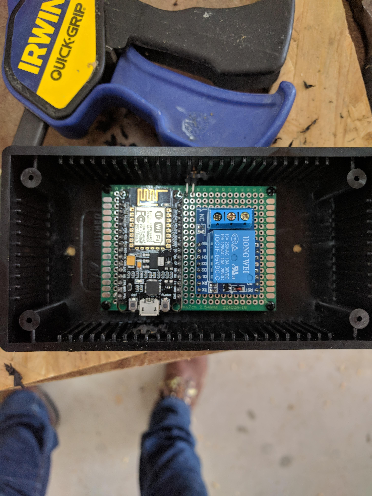

# micropython-mqtt-ha-smart-garage-door

MicroPython based Smart Garage Door on ESP8266 with Home Assistant

Read the full [blog article](https://selfhostedhome.com/diy-smart-garage-door-opener/).

